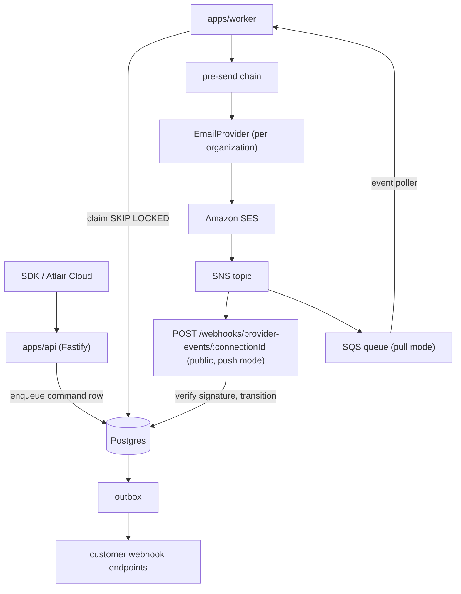
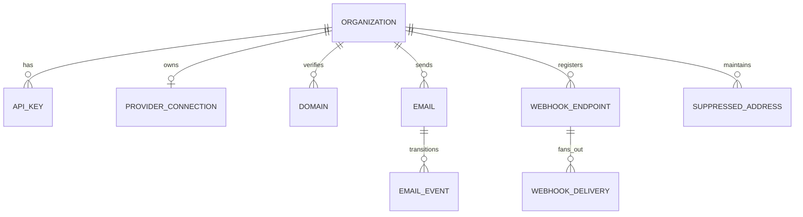

# Architecture

How atlair-mail is put together: the runtime, the domain model, the send pipeline, and the
decisions the Linear backlog assumes. For the patterns used inside each layer, see
[design-patterns.md](design-patterns.md); for the Fastify plugin stack, see
[fastify-plugins.md](fastify-plugins.md).

## System shape

Two long-running processes share one Postgres, plus Amazon SES/SNS as external dependencies.



- **`apps/api`** — HTTP surface: organizations, API keys, domains, credentials, email enqueue, SES webhooks.
- **`apps/worker`** — drains the queue, delivers the outbox and, in pull mode, reads provider events from SQS. Same packages, own process.
- **Postgres** — the single source of truth *and* the queue (see [Concurrency](#concurrency-and-delivery-guarantees)).

## Runtime decision

**The product runtime is Node + Fastify + Postgres.** It is self-hostable, which is the project's
whole premise (AGPL-3.0, independent of `atlair-platform`).

**Cloudflare Workers is an optional edge target, not the default.** It cannot run the product for a
self-hoster, so nothing may depend on it. Where it fits later: the public `POST /webhooks/provider-events/:connectionId`
receiver, and an opt-in managed deployment for Atlair's own instance.

The SES adapter uses the official `@aws-sdk/client-sesv2` (prefer maintained libraries). All SDK use
stays inside `packages/providers/src/ses/`, so if a Workers deployment ever needs it, only that adapter
is swapped (for example to SigV4 over `fetch` with `aws4fetch`); nothing else changes. See
`docs/design-patterns.md` for the provider patterns.

## Organizations and access

Everything hangs off an **organization**: the ownership and isolation boundary. It has no members;
it only owns keys, domains, emails, and a provider connection.

- **No end-user login.** atlair-mail is API-only; an API key is the only identity. Users, sessions,
  and roles belong to whatever sits on top (Atlair Cloud's dashboard). A dashboard, if one is ever
  needed, is a separate app that calls the public API.
- An API key resolves to exactly one organization; organization-scoped routes read
  `request.apiKey.organizationId`.
- The operator (Atlair Cloud or a self-hoster) provisions organizations with `ROOT_API_KEY`
  through the same public API. Atlair maps each of its orgs to one organization.
- Organizations bring **their own SES**: credentials, region, configuration set, and verified
  domains. Secrets are encrypted at rest and never leave the server.

## Data model



| Table | Role | Issue |
| --- | --- | --- |
| `organizations` | Ownership and isolation root. | ATL-80 |
| `api_keys` | A named key per caller: `permission` (`full_access` \| `sending_access`), `token_hash` (SHA-256; the token is shown once), `token_prefix`, `last_used_at`, `revoked_at`. | ATL-80 |
| `provider_connections` | One per organization: `provider` type, non-secret `settings` (jsonb), encrypted `credentials`. | ATL-75, ATL-93 |
| `domains` | Sending domains: provider-issued `dns_records` (jsonb) and verification `status`. Unique per organization. | ATL-77, ATL-81, ATL-93 |
| `emails` | The queued **command** row and its lifecycle `status`; also the queue. | ATL-77 |
| `email_events` | Append-only, idempotent log of provider events (`unique(provider_event_id)`). | ATL-77 |
| `suppressed_addresses` | Lowercased addresses that hard-bounced, complained, or were added manually. | ATL-89 |
| `webhook_endpoints`, `webhook_deliveries` | Customer webhook endpoints (encrypted signing secret) and their transactional outbox, one row per endpoint and provider event. | ATL-87 |

Key indexes: `emails(send_at) WHERE status='queued'` (partial, drives the claim);
`unique(organization_id, idempotency_key)`; `unique(email_events.provider_event_id)`.

**Conventions** (`packages/db/src/schema/`, one file per table, shared columns in `_columns.ts`):

- **IDs are UUIDv7**, generated in the app (`uuid` package). Time-ordered, so no index
  fragmentation, and no sequences to break on restore. Every table has a single-column `id`.
- **Statuses are `text` + `CHECK`**, never Postgres enums; the allowed values live in
  `packages/db/src/types.ts`.
- **Every timestamp is `timestamptz`**; mutable tables carry `created_at` and `updated_at`.
- **Foreign keys** to `organizations` are `RESTRICT` (deleting an organization is deliberate);
  child-of-child rows `CASCADE`; optional history links `SET NULL`. Every foreign key is indexed.
- **Revoke, don't delete:** API keys are revoked with `revoked_at`, so history stays intact.

## Send pipeline

```
POST /v1/emails ──▶ route ──▶ EmailService ──▶ emails row (status = queued) ──▶ 202 { id }
                                                  │
worker claims queued rows ◀───────────────────────┘
        │  pre-send chain: suppression → domain verified → (per-key limit)
        ▼
 EmailProvider (per organization: Retrying(Logging(SesProvider))) ──▶ SES
        │
SES events ──SNS──▶ POST /webhooks/provider-events/:connectionId ──▶ transition ──▶ outbox ──▶ customer webhooks
```

**Lifecycle (State):** `queued → sending → sent → delivered | bounced | complained | failed`, plus `canceled` for a scheduled send withdrawn before it is claimed.
SES events arrive duplicated and out of order, so a transition table rejects illegal moves
(e.g. `delivered → sending`) and the unique `provider_event_id` makes replays idempotent.

## Layering and packages

`routes → services → repositories → db`. Services and repositories are Fastify decorators
(`fastify.services.*`, `fastify.repositories.*`) so tests can swap any layer.

| Package | Responsibility |
| --- | --- |
| `apps/api` | HTTP routes, plugins, services, repositories. |
| `apps/worker` | Queue drain + outbox delivery. |
| `packages/db` | Drizzle schema, client factory, migrations (Factory Method + Repository). |
| `packages/core` | Framework-agnostic domain code shared by `apps/api` and `apps/worker`: credentials cipher, address and domain parsing, `loadProvider`, email status transitions. |
| `packages/providers` | `EmailProvider` interface, `createProvider`, adapters (SES today), `ProviderError` — **framework-agnostic**. |
| `packages/sdk` | Typed client generated from the OpenAPI spec (Facade). |

## Concurrency and delivery guarantees

- **The queue is Postgres.** Claim with `SELECT … WHERE status='queued' AND send_at<=now()
  ORDER BY send_at FOR UPDATE SKIP LOCKED LIMIT n`, so concurrent workers never take the same row.
- **At most once when the outcome is unknown.** A provider timeout or a crashed worker's expired lease
  fails the email instead of resending it; every send is tagged with `atlair_email_id` so provider
  events can correct it later. Duplicate provider events are absorbed by
  `email_events.provider_event_id`. See `docs/worker.md`.
- **Bounded retries.** Transient failures back off and retry; exhaustion lands in a terminal `failed`.
- **Transactional outbox** for customer webhooks: the delivery row is written in the same transaction
  as the provider event, so a restart cannot lose a notification. The worker claims due deliveries
  with `SKIP LOCKED`, signs them (Standard Webhooks) and retries 8 times over about a day. See
  `docs/webhooks.md`.

A Redis-backed queue can slot in behind the same interface later; Postgres stays the default because
it keeps self-hosting to `docker compose up`.

## Configuration and self-hosting

- Single Postgres; all configuration through `fastify.config` (`apps/api/src/env.ts`).
- `DATABASE_URL`, `ROOT_API_KEY`, `CREDENTIALS_ENCRYPTION_KEYS` (versioned AES-256 keys for the AWS
  Encryption SDK that encrypts SES secrets),
  `RATE_LIMIT_*`, and provider/SNS settings (topic ARN allowlist).
- Secrets are never returned in responses or written to logs (pino `redact`).

## Open decisions

1. **Credential model** — encrypted static access keys first; STS/AssumeRole with a per-organization
   external ID later for managed deployments. The KMS keyring can replace the raw AES keyring then.
2. **Shared domain code** — `packages/core` now exists (credentials cipher); the status state machine
   moves there when the worker lands.
3. **Workers target** — revisit only when Atlair's managed deployment needs it.
